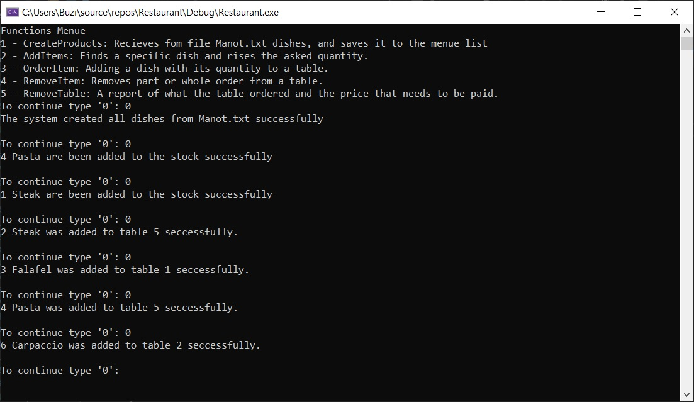
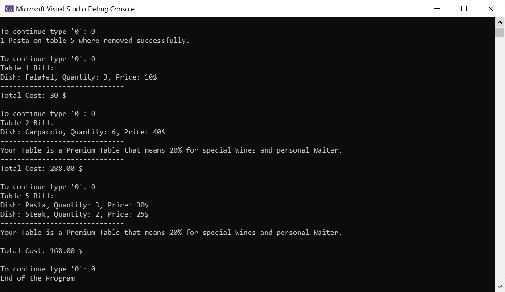

# Restaurant

## System description:
Computerized system for managing a restaurant with linked lists. 
The restaurant has two components: a kitchen that creates dishes and a dining room.

## Program Input:

The input for the program is made from two files: 
- The first input comes from the Instructions.txt file, which contains sequence of orders to be done in a restaurant, for example: ordering a dish, canceling a dish, closing a table, etc. 
Each line in this file will represent a function in a restaurant: 
The first character in the row will be a number between 1-5 that represents the serial number of the existing function that needs to be run. The other words/numbers in the same line will be needed parameters for the selected function. 
Each parameter will be separated by one space in the same row.
- The second input comes from the Manot.txt input file, which contains the details of the dishes that will be send to the kitchen when the restaurant opens.
- A menu should be displayed on the screen with a description of the functions. The program waits for users input of the character "0." When you enter this character, one line of the Instructions file is recorded, this line will be decoded and run the appropriate function (as mentioned - according to the first character in the line and the parameters that will appear after it). At the end of the function, the corresponding output will be displayed on the screen, and the main menu will appear again, until another "0" character is received, until the end of the lines in the Instructions file.  

 

